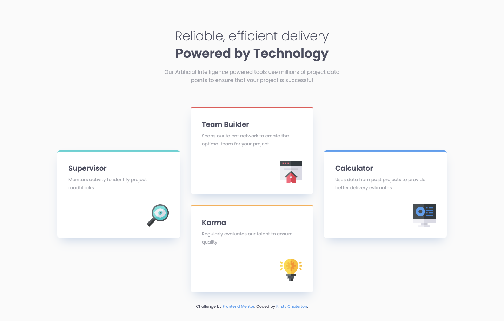

# Frontend Mentor - Four card feature section solution

This is a solution to the [Four card feature section challenge on Frontend Mentor](https://www.frontendmentor.io/challenges/four-card-feature-section-weK1eFYK). Frontend Mentor challenges help you improve your coding skills by building realistic projects.

## Table of contents

- [Overview](#overview)
  - [The challenge](#the-challenge)
  - [Screenshot](#screenshot)
  - [Links](#links)
  - [Built with](#built-with)
  - [Author](#author)

**Note: Delete this note and update the table of contents based on what sections you keep.**

## Overview

### The challenge

Users should be able to:

- View the optimal layout for the site depending on their device's screen size

### Screenshot

### Links

- Solution URL: [https://www.frontendmentor.io/solutions/solution-for-four-card-feature-section-4eWy-l_sl](https://www.frontendmentor.io/solutions/solution-for-four-card-feature-section-4eWy-l_sl)
- Live Site URL: [https://kirstchat.github.io/four-card-feature-section/](https://kirstchat.github.io/four-card-feature-section/)

## My Process

### Built with

- Semantic HTML5 markup
- CSS custom properties
- Flexbox
- Mobile-first workflow

## Author

- LinkedIn - [Kirsty Chatterton](https://www.linkedin.com/in/kirsty-c-154781a4/)
- Github - [KirstChat](https://github.com/KirstChat)
- Frontend Mentor - [@KirstChat](https://www.frontendmentor.io/profile/KirstChat)
